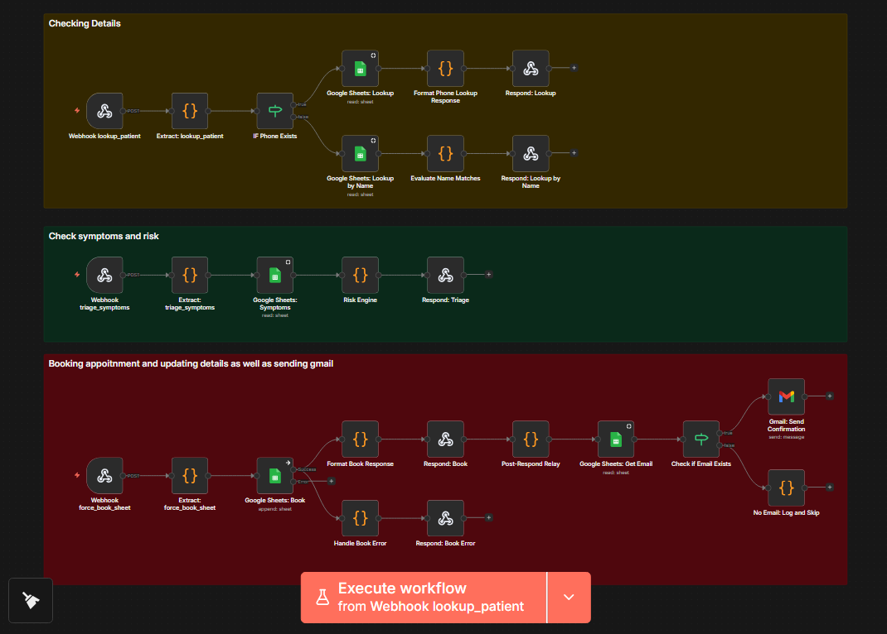

# VITALS: A RAG-Powered Multilingual AI Voice Agent to detect early illness escalation through automated human-like check-ins (Open-Source Developer Edition)

<p align="center">
  
</p>

<p align="center">
  <strong>AI-powered voice calling system for proactive chronic patient monitoring and automated clinical documentation</strong>
</p>

<p align="center">
  <strong>🏆 Hacknovate 7.0 Winning Project 🏆</strong>
</p>

> [!IMPORTANT]
> ### Production infrastructure is intentionally withheld for security, privacy, and healthcare compliance requirements.
> **Safety Measure Notice:** As a safety measure before the official release, all backend source code, testing scripts, and other proprietary components have been removed from this repository. This repository is intended strictly to showcase our project architecture, the frontend interface, and our n8n automation / RAG integration, rather than being a fully open-source implementation.

---

## 🎥 Demo Videos

### Project Overview
[](https://youtu.be/NzspuiscC0k?si=1qYNsL4viLquzjCD)

---

## 👥 Contributors

| Name | GitHub |
| :--- | :--- |
| **Aryan Saini** | [@aryan-saini-dev](https://github.com/aryan-saini-dev) |
| **Aryan Gusain** | [@AryanGusain-dev](https://github.com/AryanGusain-dev) |
| **Archee Sinha** | [@ArcheeSinha](https://github.com/ArcheeSinha) |
| **Darshita Gupta** | [@darshita-gupta](https://github.com/darshita-gupta) |

---

## 💡 Problem Statement

Current healthcare is reactive and manual, leading to three primary systemic failures:

- **Ignoring Symptoms:** Chronic patients often overlook subtle symptom links (e.g., a "metallic taste" in Type 2 Diabetes indicating a shift to Type 3), which leads to preventable emergencies.
- **Staff Overload:** Medical professionals are too burdened to provide continuous manual monitoring for every chronic patient at home.
- **Efficiency Loss:** Manual history-taking consumes the majority of a patient's visit, leaving minimal time for actual treatment and consultation.

**VITALS solves this** by deploying AI voice agents that conduct automated health check-ins, extract clinical insights, and generate physician-ready reports.

---

## ✨ Features

- **🤖 AI Voice Agents** – Configurable voice assistants for automated patient calls
- **📊 Real-time Dashboard** – Monitor all patients, calls, and alerts in one view
- **📝 Automated Reports** – AI-generated clinical summaries with risk assessment ([Sample Report](Assets/Anita%20Report.pdf))
- **💬 WhatsApp Integration** – Instant notifications and appointment scheduling
- **🔔 Smart Alerts** – Automated alerts for abnormal vitals or missed medications
- **🩺 Clinical Assessment** – Structured symptom tracking and clinical evaluation

---

## 🛠️ Tech Stack

### Frontend
| Technology | Purpose |
|------------|---------|
| **React 18** + **TypeScript** | UI framework with type safety |
| **Vite** | Fast development & building |
| **Tailwind CSS** + **shadcn/ui** | Styling and component library |
| **TanStack Query** | Server state management |
| **React Router** | Client-side routing |
| **Recharts** | Data visualization |
| **jsPDF** | PDF report generation |

### Backend
| Technology | Purpose |
|------------|---------|
| **Express.js** | REST API server |
| **Supabase** | PostgreSQL database + Auth + Storage |
| **Vapi AI** | Voice call automation & webhooks |
| **Google Gemini API** | AI reasoning & clinical report generation |
| **whatsapp-web.js** | WhatsApp messaging integration |

### RAG System (Python)
| Technology | Purpose |
|------------|---------|
| **LangChain** | LLM orchestration |
| **ChromaDB** | Vector database for medical knowledge |
| **Sentence Transformers** | Text embeddings |
| **Pandas** | Data processing |
| [**MedQuAD Dataset**](https://www.kaggle.com/datasets/rudrik01/medquad) | 16,000+ medical Q&A pairs |

### Testing & DevOps
| Technology | Purpose |
|------------|---------|
| **Vitest** | Unit testing |
| **Playwright** | E2E testing |
| **ESLint** + **TypeScript ESLint** | Code linting |

---

## � Project Structure

```
vitals-heatlhcare/
├── src/                          # React frontend
│   ├── components/               # UI components (shadcn/ui + custom)
│   │   └── ui/                   # Base shadcn components
│   ├── pages/                    # Route pages
│   │   ├── Login.tsx
│   │   ├── Signup.tsx
│   │   └── dashboard/            # Dashboard views
│   │       ├── Overview.tsx
│   │       ├── Patients.tsx
│   │       ├── Calls.tsx
│   │       ├── Alerts.tsx
│   │       ├── Agents.tsx
│   │       ├── CreateAgent.tsx
│   │       ├── SimulateCall.tsx
│   │       ├── CallDetail.tsx
│   │       ├── PatientDetail.tsx
│   │       └── MisdiagnosisSolution.tsx
│   ├── hooks/                    # Custom React hooks
│   └── lib/                      # Utilities & helpers
├── server/                       # Express.js API
│   └── index.ts                  # Main server (1,600+ lines)
├── RAG_vitals/                   # Python RAG system
│   ├── rag_pipeline.py           # Main orchestrator
│   ├── cli.py                    # Interactive CLI
│   ├── config.py                 # Configuration
│   ├── loader.py                 # Data ingestion
│   ├── chunker.py                # Text chunking
│   ├── embedder.py               # Vector embeddings
│   ├── retriever.py              # Similarity search
│   ├── augmenter.py              # Context formatting
│   ├── llm.py                    # Gemini integration
│   └── medquad.csv               # Medical dataset
├── Assets/                       # Screenshots & reports
```

---

## ⚙️ Workflow Diagram

### n8n + VITALS Showcase
This video is a showcase of our n8n + VITALS integration, demonstrating improved fetching of patient details and automated appointment scheduling:

https://github.com/aryan-saini-dev/Vitals-OpenSource-Edition/blob/main/Assets/Vitals-n8n.mp4

### n8n Autonomous Automation
<p align="center">
  
</p>

**Explore the Workflow:** We have made the n8n automation workflow structure freely available for exploration:
[**[⚙️ vitals-workflow.json]**](n8n/vitals-workflow.json)

```
┌─────────────────┐     ┌──────────────────┐     ┌─────────────────┐
│   Patient DB    │────▶│   Vapi AI Agent  │────▶│  Voice Call     │
│   (Supabase)    │     │   (Twilio +      │     │  (Deepgram      │
└─────────────────┘     │   Deepgram)      │     │   Nova 3)       │
                        └──────────────────┘     └────────┬────────┘
                                                           │
                    ┌──────────────────────────────────────┘
                    ▼
┌─────────────────────────────────────────────────────────────────┐
│                         CALL FLOW                               │
│  ┌──────────────┐   ┌──────────────┐   ┌──────────────────┐   │
│  │  Symptom     │──▶│  RAG System  │──▶│  Risk Assessment │   │
│  │  Collection  │   │  (ChromaDB)  │   │  (Gemini API)    │   │
│  └──────────────┘   └──────────────┘   └────────┬─────────┘   │
└───────────────────────────────────────────────────┼─────────────┘
                                                    │
                    ┌───────────────────────────────┘
                    ▼
┌─────────────────────────────────────────────────────────────────┐
│                      OUTPUT GENERATION                          │
│  ┌──────────────┐   ┌──────────────┐   ┌──────────────────┐   │
│  │  PDF Report  │   │  WhatsApp    │   │  Clinical        │   │
│  │  (jsPDF)     │   │  Alert       │   │  Dashboard       │   │
│  └──────────────┘   └──────────────┘   └──────────────────┘   │
└─────────────────────────────────────────────────────────────────┘
```


---

## �📸 Application Screenshots

### Landing Page
<p align="center">
  
</p>

### Patient Dashboard, Mock Calls & Clinical Assessment
| Patients Dashboard | Mock Call Testing | Clinical Assessment |
|:------------------:|:-----------------:|:-------------------:|
|  |  |  |

### Vitals Extracted & Call Summary
| Vitals Extracted | Call Summary & Transcripts |
|:----------------:|:--------------------------:|
|  |  |

### Edit Report & WhatsApp Appointment
| Edit Report (Natural Language) | WhatsApp Appointment |
|:------------------------------:|:--------------------:|
|  |  |

### 📄 Sample Generated Report

The system generates physician-ready PDF reports after each call. View a sample report:

**[📋 Anita Report.pdf](Assets/Anita%20Report.pdf)**

---

## 🚀 Getting Started

> [!NOTE]
> The full source code and comprehensive installation guide will be available here when the application is officially open-sourced. For now, you can explore the architecture through our RAG and n8n setups.

### Medical RAG System Setup

We've developed a custom **Retrieval-Augmented Generation (RAG)** pipeline in Python that utilizes ChromaDB and Google Gemini to assist the voice agent with verified medical knowledge.

👉 **[View the RAG System Setup Guide](RAG_vitals/README.md)**

### n8n Automation Setup

The autonomous workflow that drives our system is fully accessible. You can view the structure and import it directly into your own n8n instance:

👉 **[View the n8n Workflow JSON](n8n/vitals-workflow.json)**

---


## 🔗 API Keys Setup Guide

| Service | How to Get Keys |
|---------|-----------------|
| **Supabase** | Create project at [supabase.com](https://supabase.com) → Project Settings → API |
| **Gemini** | Get API key at [aistudio.google.com/app/apikey](https://aistudio.google.com/app/apikey) |
| **Vapi** | Sign up at [vapi.ai](https://vapi.ai) → Dashboard → API Keys & Assistants |
| **MedQuAD Dataset** | Download from [Kaggle](https://www.kaggle.com/datasets/rudrik01/medquad) for RAG system |

---

## ⚙️ Vapi Configuration Notes

For optimal voice call performance, configure your Vapi assistant with:

1. **Twilio Integration** – Connect your Twilio account to Vapi for phone number provisioning and call handling
2. **Deepgram Nova 3** – Use Deepgram's Nova 3 model for multilingual voice recognition and natural-sounding responses
3. **RAG Connection** – Link your Vapi assistant webhook to the RAG system endpoint for enhanced symptom recognition and medical knowledge retrieval

---

## 🔮 Future Scope

- **🚑 Ambulance Calling** – Automatic emergency service dispatch when conversations escalate to critical scenarios
- **🔒 Privacy-First Architecture** – De-identification layer or local LLM deployment for patient data protection
- **🏥 Hospital Services Integration** – Direct integration with hospital systems for medicine dosage tracking, appointment scheduling, and EHR synchronization

---
